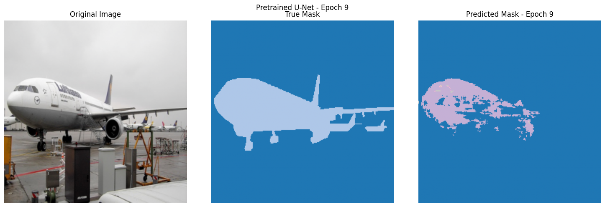
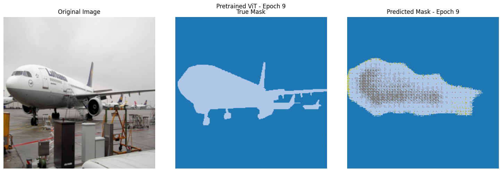
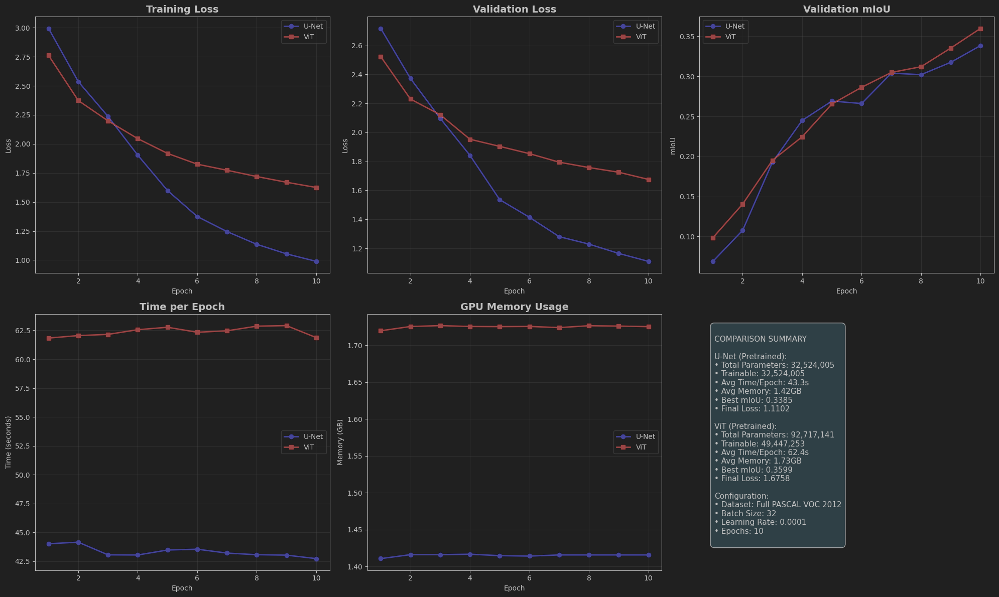
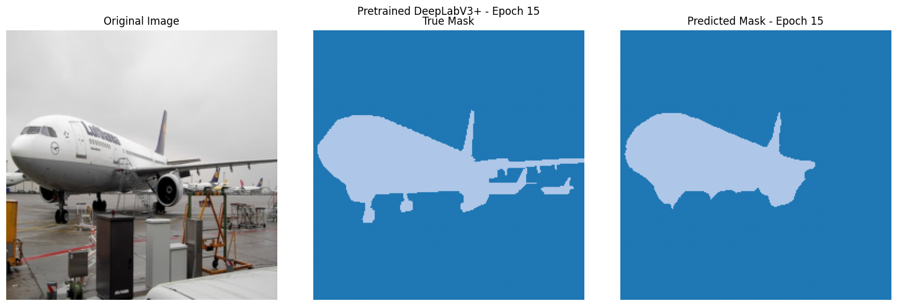
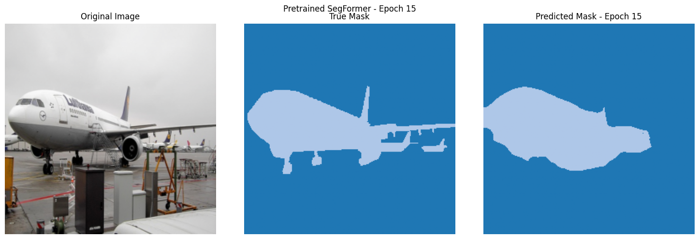
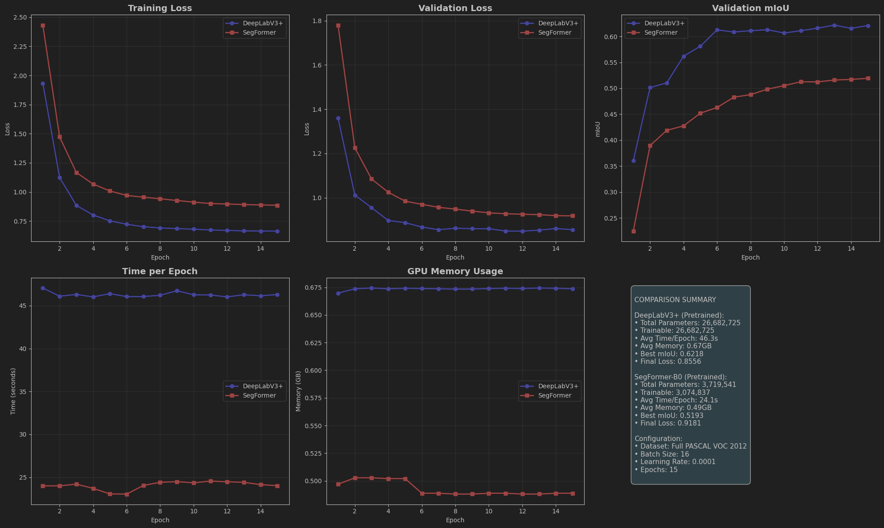

# Semantic segmentation Encoder-Decoder vs Transformers:

Encoder-decoder модели используют избыточное число параметров из-за необходимости в глубоких свёрточных слоях для захвата глобального контекста. В отличие от них, трансформеры обеспечивают глобальное взаимодействие между пикселями через механизм внимания, что делает их более параметрически эффективными.

Для сравнения моделей возьмем датасет pascal voc, т.к. он не слишком большой и его легко скачать.

## Эксперимент 1:

Для encoder-decoder модели в качестве baseline возьмем знаменитый u-net, для трансформерной модели возьмем модель из экзамплов hf для ViT. Большинство ViT обучаются под задачу классификации, поэтому нам нужно повесить сверху голову на сегментацию.

По результатам эксперимента модели за 10 эпох выдают почти одинаковый mIoU около 0.35. Для baseline метрика подходящая, однако оказалось что у этой ViT модели 92 миллиона параметров против 32 у u-net, соответственно и расходы по памяти и времени обучения выше. Поэтому, решил взять более легкую модель с трансформерной архитектурой.

## Эксперимент 2:

Для encoder-decoder модели возьмем SOTA на pascal voc - DeepLabv3+, в качестве трансформерной модели на HF под задачу сегментации найдем небольшую по размеру модель MiT - SegFormer-b0 и сравним их. Обе модели предобучены под задачу сегментации.

В рамках наших ресурсов будем обучать модели 15 эпох.

В ходе эксперимента было выявлено значительное различие в количестве параметров между моделью DeepLabV3+ (26,682,725 параметров) и SegFormer-B0 (3,719,541 параметров). Основной причиной столь существенной разницы является архитектурное отличие между данными моделями.

DeepLabV3+ построен на классической сверточной архитектуре и использует в качестве бэкбона тяжелую сверточную модель resnet50, которая сама по себе содержит десятки миллионов параметров. Кроме того, в архитектуре DeepLabV3+ применяется модуль ASPP (Atrous Spatial Pyramid Pooling), включающий несколько параллельных сверточных операций. Этот модуль значительно увеличивает общее число параметров, особенно на этапах обработки пространственной информации с высоким разрешением.

С другой стороны, SegFormer-b0 основан на более легковесной и эффективной трансформерной архитектуре MiT (Mix Vision Transformer). В этой архитектуре отсутствуют позиционные эмбеддинги, а вместо громоздкого сверточного декодера используется простой MLP-декодер, объединяющий выходы с различных уровней encoder'а. Благодаря этому значительно снижается количество параметров. Кроме того, трансформерная часть модели реализована эффективно: self-attention слои позволяют передавать информацию на большие расстояния без необходимости глубоких сверточных каскадов, что также сокращает количество обучаемых весов.

Компактность SegFormer-b0 обусловлена отсутствием тяжелого сверточного бэкбона, упрощенным декодером и эффективной реализацией attention-механизмов.

Мы обучали модели чуть дольше, DeepLabV3+ действительно выдает лучшее качество чем SegFormer, однако проигрывает по количеству обучаемых параметров, следовательно использует больше памяти видеокарты при обучении для хранения весов модели и требует почти в 2 раза больше времени на обучение.

Несмотря на компактность SegFormer, благодаря более новой архитектуре, на 10 эпохе он показывает лучший перформанс по сравнению с моделями из 1го эксперимента.

Таким образом, несмотря на просадку по метрике mIoU против SOTA модели, трансформерная архитектура потребляет гораздо меньше вычислительных ресурсов, а значит позволяет использовать качественную модель на устройствах с ограниченными ресурсами.

